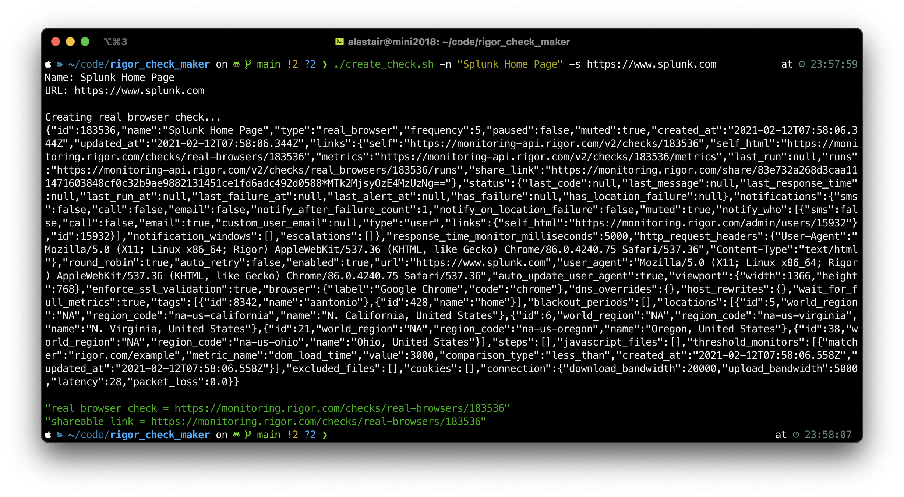
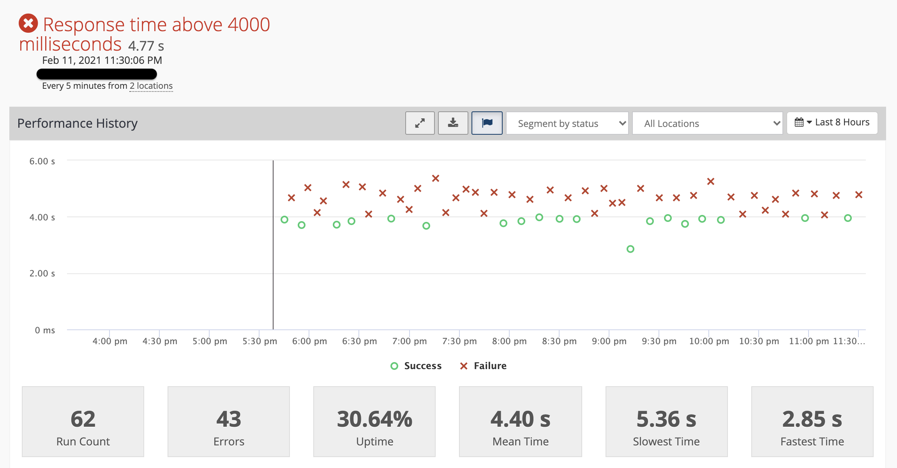

# Script to create Rigor Real Browser Checks
Create and share a Rigor Real Browser check in seconds. Run the Bash script in your terminal, specifying 1) name of the check and 2) site url to check. The script will create the check and return the URLs to view it as a logged in user and a publicly shareable version as well.

`./create_check.sh --name "Splunk Home Page Test" --site https://www.splunk.com`

<p align="center">
  
</p>

## Prerequisites
You may need to install `jq` if you do not have it already installed in your shell. You can install via brew by running `brew install jq`

## How to use create_check.sh
1. clone this repo
2. edit the following items in `create_check.sh`
    1. replace the &lt;API-KEY&gt; with your own (found at https://monitoring.rigor.com/settings)
        ```
        rvm_curl_args=(
            -H 'content-type:application/json' 
            -H 'API-KEY:MYAPIKEY' 
        ```
    2. replace/add custom tags as desired in the &lt;MY_TAG&gt; section - comma separated.
        ```
        "tags": [
            "aantonio","ecommerce"
        ],
        ```
    
    3. run the script 
        ```
        ./create_check.sh --name "Splunk Home Page Test" --site https://www.splunk.com
        ```
         Note: Need to include `http://` or `https://`, no quotes necessary.
    4. copy and paste the shareable link to easily share and collaborate
## Ouput and Sharing
At the end of the script, two URLs are echoed back out:
1. link to the check that was just created - need a Rigor login to view
2. shareable link - publicly accessible sandboxed link


## Extra configurations (optional)
1. `locations`
    1. add/change locations, using the accompanying `locations.txt` to reference the desired sites. *Note that not all site enums are for "real browser" and that the list is not fully updated at this time.*
    ```
    "locations": [
        5,6,21,38    
    ],
    ```
    These locations map to:  
    ```
    5    "na-us-california" "real_browser"    "N. California, United States"
    6    "na-us-virginia"   "real_browser"    "N. Virginia, United States"
    21   "na-us-oregon"     "real_browser"    "Oregon, United States"
    38   "na-us-ohio"       "real_browser"    "Ohio, United States"
    ```

2. `response time monitor`
    1. specify the acceptable response time threshold in milliseconds

3. `frequency`
    1. currently defaulted to every 5 minutes
    ```
    "frequency": 5,
    ```
4. many more - documented at https://monitoring-api.rigor.com/


<p align="center">
  
</p>


